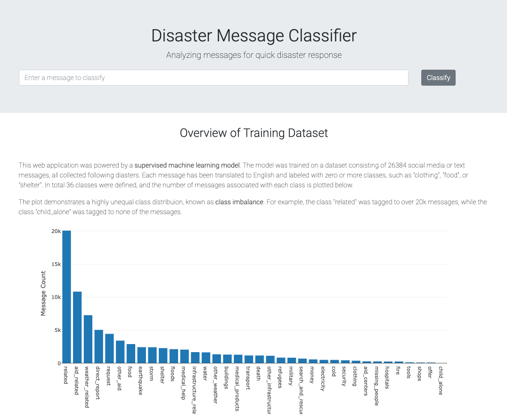

# Disaster-Message-Classifier

<summary><h2 style="display: inline-block">Table of Contents</h2></summary>
<ol>
<li>
    <a href="#about-the-project">About The Project</a>
</li>
<li>
    <a href="#getting-started">Getting Started</a>
</li>
<li><a href="#methods-and-results">Methods and Results</a></li>
<li><a href="#discussion">Discussion</a></li>
<li><a href="#acknowledgements">Acknowledgements</a></li>
</ol>

## About The Project
When diaster happens, people rely on social media and text messages to request for help. If these messages can be processed in a timely and precise manner, there is a higher chance that people with needs can be connected to the appropriate disaster relief agency.

Inspired by this need, this project trains a ***supervised machine learning model*** to automatically process diaster messages and classify people's needs into multiple categories, such as "clothing", "food", and "shelter". This project also builds a Flask-based ***web application***, which allows an emergency worker to input a message and instantly get classification results. 

 
## Getting Started
- Prerequisites
    ```
    Python==3.8.8
    Flask==1.1.2
    SQLAlchemy==1.4.7
    plotly==5.3.1
    pandas==1.2.4
    dill==0.3.4
    nltk==3.6.1
    scikit_learn==1.0.1
    ```
- Clone the repo
   ```
   git clone https://github.com/chenby04/disaster_message_classifier.git
   ```
- File descriptionsd
  
    This project has three main folders. The `app` folder holds the Flask-based web application. The `data` folder holds the raw dataset (messages collected following diasters with class labels), the script for an ETL pipeline, and the cleaned data. The `models` folder holds the script for an ML pipeline and the trained model.
   ```
   disaster_message_classifier/
    - app/
    | - templates/
    | |- master.html  # main page of web app
    | |- go.html  # classification result page of web app
    |- run.py  # Flask file that runs app

    - data/
    |- disaster_categories.csv  # raw data to process 
    |- disaster_messages.csv  # raw data to process
    |- process_data.py  # ETL pipeline - merge and clean raw data
    |- InsertDatabaseName.db   # cleaned data saved as sqlite database

    - models/
    |- train_classifier.py # ML pipeline - supervised classification model
    |- classifier.pkl  # model saved as a pickle file

    - requirements.txt # python packages are required to run the project
    - overview.png # snapshot of web app
    - results.png # snapshot of web app
    ```

- Usage
    
    Run the ETL pipeline from `data` folder to clean the raw data and save cleaned data as an sqlite database:
    ```
    python process_data.py disaster_messages.csv disaster_categories.csv DisasterResponse.db
    ```

    Run the ML pipeline from `models` folder to train a supervised classification model using the cleaned data: 
    ```
    python train_classifier.py ../data/DisasterResponse.db classifier.pkl
    ```

    Run the web app script from `app` folder and see the app in browser at http://0.0.0.0:3001/
    ```
    python run.py
    ```


## Methods and Results
- Data inspection and cleaning

    The raw training dataset consists of 26384 messages collected following diasters, where each message has been labeled with zero or more of the 36 pre-defined class. Each class is a type of help needed, such as "clothing" or "food". 
    
    Upon inspection, 206 duplicated messages were removed. The inspection also shows a highly skewed class distribution, where major classes like `aid_related` was tagged to over 10k messages while minor classes like `clothing` was tagged to only 404 messages. More surprisingly, the class `child_alone` was tagged to none of the messages and therefore becoming untrainable. This skewed class distribution is known as ***class imbalance***, which needs to be taken into consideration during training, as discussed in the following section.

- Machine learning model  

    To prepare for the training, each message was tokenized and transformed. Steps of tokenization included removing punctuations, normalizing case, spliting words by space, removing stop words, lemmatizing, and stemming. Steps of transformation included vectorization and TF-IDF transformation. 
 
    A multi-label classification model was trained. Because accuracy is not a good metric for imbalanced dataset, f1-score was used instead. Note that f1-score has different flavors: `macro f1-score` weighs each class equally whereas `micro f1-score` weighs each sample equally. If the goal of the training is to get as many samples correct as possible not favoring any class, micro is preferred, but if the goal of the training is to get minor classes correct as well, macro is preferred. ***In this project, macro was employed because I consider minor classes such as `clothing` equally or sometimes more important than major classes such as `aid_related`***.

    (TODO) Five algorithms from the scikit-learn library were evaluated: naive Bayes, logistic regression, random forest, SVM, and a hard voting ensamble of the previous four. Grid search was employed to tune the hyperparameters for each algorithm, and the macro f1-scores are summarized below.
    
    | Algorithm           	|   Train   	|    Test    	| Train-Test Diff	|
    |---------------------	|:---------:	|:----------:	|:---------------:	|
    | Naive Bayes         	|    0.64   	|    0.60    	|    0.04    	    |
    | Logistic Regression 	|    0.74   	|    0.67    	|    0.07       	|
    | Random Forest       	|    0.72   	|    0.64    	|    0.08       	|
    | SVM               	|    0.73   	|    0.68    	|    0.05       	|
    | Voting              	|    0.71   	|    0.64    	|    0.07       	|

    (TODO) Among the five algorithms, SVM shows the highest score and the second least overfitting. Class-specific scores using SVM were also calculated.

- Web application
    
    A Flask-based web application was developed. The web application serves two purposes. First, it provides a graphical overview of the training data. Second, it implements the trained model to classify user input messages into pre-defined classes. 
    
    


## Discussion
Despite trying multiple models and using grid search to search for optimized parameters, the performance of the model was mediocre. Part of this can be attributed to the training dataset's limited size and imbalanced classes. However, ***to me, what limited the performance most is the poor labeling quality of the training data***. For example, one training data contains the message "How we can find food and water? we have people in many differents needs, and also for medicine at Fontamara 43 cite Tinante.", but it was labeled as negative for categories such as "medical_products", "water", and "food". In another example, the training message is "People from Dal blocked since Wednesday in Carrefour, we having water shortage, food and medical assistance.", but it was labeled as true for "earthquake". 

No model can make up for bad data - especially in supervised learning. To truly improve the classification performance, the labels of the training data must be accurate and consistent. 


## Acknowledgements
- This project is part of the training provided by Udacity's [Data Scientiest Nanodegree Program](https://www.udacity.com/course/data-scientist-nanodegree--nd025).


